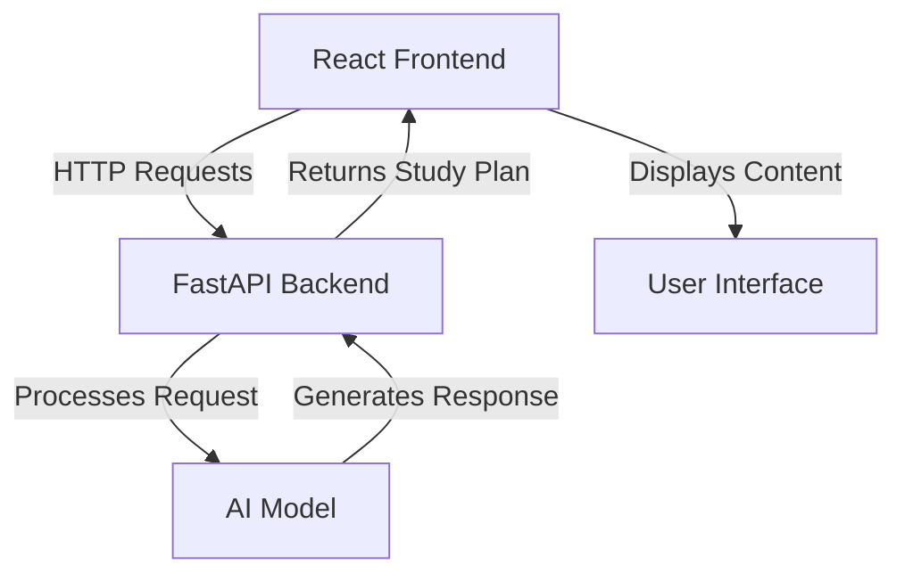

# Learning Assistant Application

A comprehensive learning assistant that generates personalized study plans and detailed lesson content using AI. The application consists of a React frontend and a Python FastAPI backend.

## Architecture



## Features

### Frontend
- Modern, responsive UI built with React and Material-UI
- Real-time study plan generation
- Interactive session management
- Detailed lesson plan visualization
- Loading states and error handling

### Backend
- RESTful API endpoints for chat and session management
- AI-powered study plan generation
- Session-based conversation tracking
- Detailed lesson content generation
- Error handling and logging

## Project Structure

```
learning_assistant/
├── frontend/               # React frontend application
│   ├── src/
│   │   ├── App.js         # Main application component
│   │   └── ...
│   └── package.json
│
└── backend/               # FastAPI backend application
    ├── app/
    │   ├── main.py       # Main application entry point
    │   ├── models/       # Data models
    │   ├── services/     # Business logic
    │   └── utils/        # Utility functions
    └── requirements.txt
```

## Getting Started

### Prerequisites
- Node.js (v14 or higher)
- Python 3.8 or higher
- pip (Python package manager)

### Backend Setup

1. Navigate to the backend directory:
```bash
cd backend
```

2. Create and activate a virtual environment:
```bash
python -m venv venv
source venv/bin/activate  # On Windows: venv\Scripts\activate
```

3. Install dependencies:
```bash
pip install -r requirements.txt
```

4. Start the backend server:
```bash
uvicorn app.main:app --reload --port 8082
```

### Frontend Setup

1. Navigate to the frontend directory:
```bash
cd frontend
```

2. Install dependencies:
```bash
npm install
```

3. Start the development server:
```bash
npm start
```

The application will be available at:
- Frontend: http://localhost:3000
- Backend: http://localhost:8082

## API Endpoints

### Backend API

- `GET /new-session`: Create a new chat session
- `POST /chat`: Generate a study plan based on user input
  - Request body: `{ "text": string, "session_id": string, "user_id": string }`
  - Response: Study plan with detailed lesson content

## Usage

1. Open the application in your browser
2. Enter your learning request in the input field
3. Click "Generate Study Plan"
4. View your personalized study plan with:
   - Daily topics and durations
   - Detailed lesson content
   - Practice problems
   - Key takeaways

## Error Handling

The application includes comprehensive error handling for:
- API connection issues
- Invalid user inputs
- Session management errors
- Study plan generation failures

## Contributing

1. Fork the repository
2. Create a feature branch
3. Commit your changes
4. Push to the branch
5. Create a Pull Request

## License

This project is licensed under the MIT License - see the LICENSE file for details.

## Acknowledgments

- React and Material-UI for the frontend framework
- FastAPI for the backend framework
- OpenAI for AI model integration 